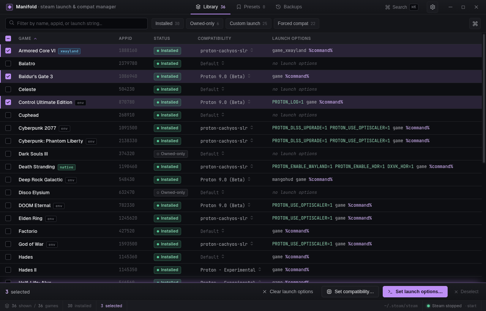
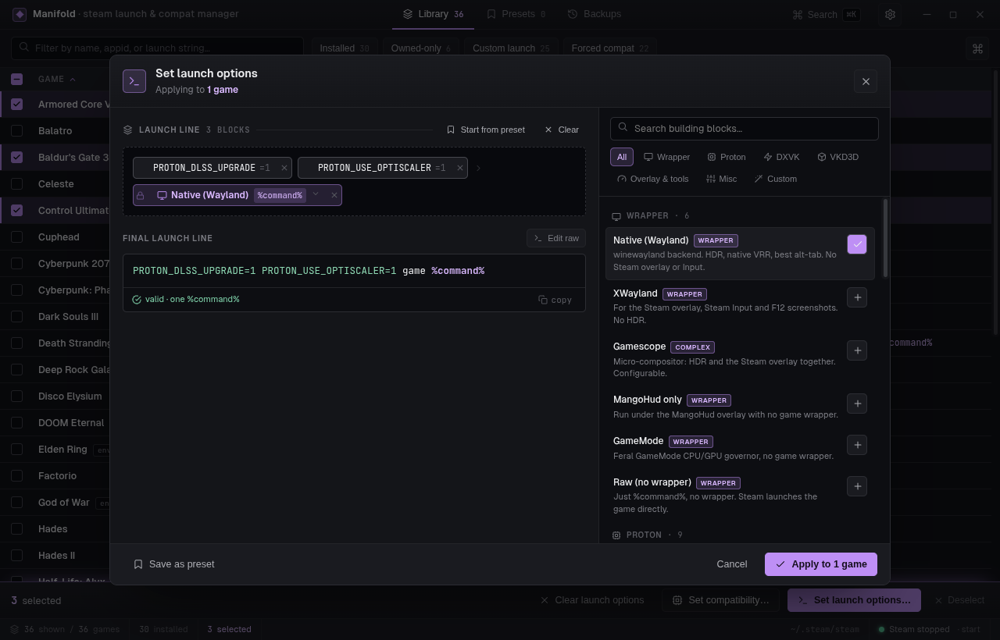

<div align="center">

# Manifold

**Bulk-manage Steam launch options and Proton compatibility, fast.**

A dense, keyboard-friendly desktop tool for editing the launch options and forced
compatibility tool of many Steam games at once, with a structured builder, live validation,
and safe, backed-up writes.

[](https://github.com/yasen-pavlov/manifold/actions/workflows/ci.yml)
[](https://sonarcloud.io/summary/new_code?id=yasen-pavlov_manifold)
[](https://sonarcloud.io/summary/new_code?id=yasen-pavlov_manifold)
[](LICENSE)
[](https://tauri.app)



</div>

---

## Why

Steam buries launch options one game at a time, behind a dialog. If you run Proton on Linux
and tune `PROTON_*` / `DXVK_*` env vars, wrappers like `gamescope` or `mangohud`, or force a
specific Proton build per game, doing it across a library is tedious and error-prone.

Manifold reads your real Steam config, shows the whole library in one dense table, and lets
you compose a launch line from a catalogue of building blocks and **apply it to many games at
once**. Every write is guarded, backed up, and atomic.

## Features

- **Whole-library table.** Installed and owned-only games, AppID, forced compatibility tool,
  and the current launch line, all searchable and sortable. Multi-select and bulk-apply.
- **Structured launch builder.** Compose a launch line from a catalogue of building blocks:
  wrappers (Native Wayland, XWayland, Gamescope, MangoHud, GameMode), Proton/DXVK/VKD3D env
  vars (toggles, dropdowns, free inputs), overlays, and custom fragments. Drag pills to
  reorder, click to edit, drop the wrapper in place. There is a raw-edit escape hatch too.
- **Live validation.** Exactly one `%command%`, warnings for unknown wrappers, commands not on
  PATH, and stale/legacy options (e.g. `gamescope_proton`, `hdr_run`).
- **Unified presets.** Save any launch line as a named preset and apply it across a selection.
- **Bulk compatibility.** Set or clear the forced Proton/compat tool for many games at once.
- **Safe writes.** Manifold only writes while Steam is closed (Steam rewrites its config on
  exit). It offers to close, apply, and optionally reopen Steam; every change is timestamped
  and backed up before an atomic write.
- **Owned-only resolution.** Resolves names for owned-but-not-installed games from Steam's
  app cache, fully offline.

<div align="center">

</div>

## How it works

Manifold edits two Steam config files directly:

- `.../userdata/<id>/config/localconfig.vdf` -> per-game `LaunchOptions`
- `.../config/config.vdf` -> `CompatToolMapping` (the forced compatibility tool)

`localconfig.vdf` is large and order-sensitive, so Manifold does **surgical, lossless text
edits** (tokenize, locate, splice) rather than round-tripping the whole file through a parser.
Writes are gated on Steam being closed, snapshot the affected entries to
`~/.local/share/manifold/backups/`, and land via a temp-file atomic rename.

## Install

Grab the latest installer for your OS from the
[**Releases**](https://github.com/yasen-pavlov/manifold/releases) page:

- **Linux**: `.AppImage` or `.deb`
- **Windows**: `.msi` / `.exe`
- **macOS**: `.dmg` (Apple Silicon and Intel)

> **Platform note**: Manifold's Steam integration currently targets **Linux** (it reads the
> Linux Steam layout and controls the Steam process there). The macOS and Windows builds are
> provided and will install and launch, but library scanning and writes are Linux-only for now.
> Cross-platform Steam support is on the roadmap.

## Build from source

Prerequisites: [Rust](https://rustup.rs), Node 22+, and the
[Tauri system dependencies](https://tauri.app/start/prerequisites/) for your OS.

```bash
git clone https://github.com/yasen-pavlov/manifold.git
cd manifold
npm ci

# run the app in dev
npm run tauri dev

# produce a release bundle for your platform
npm run tauri build
```

### Tests

```bash
npm test                                            # frontend (Vitest)
npm run coverage                                    # frontend coverage (LCOV)
cargo test --manifest-path src-tauri/Cargo.toml     # backend (Rust)
```

## Tech stack

- **[Tauri 2](https://tauri.app)** desktop shell with a **Rust** backend (Steam config parsing,
  guarded writes, process control, app-cache name resolution).
- **[React 19](https://react.dev)** + **Vite** frontend with a hand-rolled, plain-CSS design
  system (no UI kit). Geist for chrome, JetBrains Mono for machine strings.
- **Vitest** (frontend) and Rust's built-in test harness (backend), with coverage reported to
  **SonarCloud**.

## Roadmap

- Real backup restore UI, audit view, and a "which Proton actually ran" column
- System tray, packaging polish
- Cross-platform Steam support (Windows/macOS paths and process control)
- ProtonDB rating badges, preset import/export

## License

[MIT](LICENSE) (c) 2026 Yasen Pavlov.

> Manifold is an independent tool and is not affiliated with or endorsed by Valve or Steam.
> It edits your local Steam configuration; use it at your own risk and keep Steam closed when
> applying changes.
